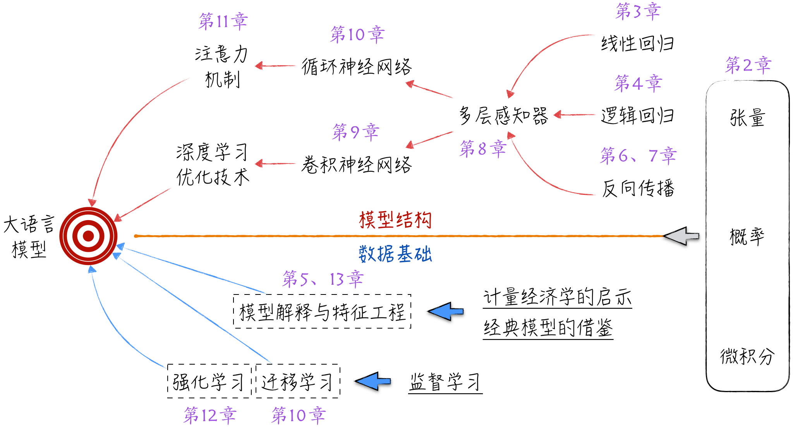

# 《解构大语言模型：从线性回归到通用人工智能》配套代码

[在线阅读](https://gentang.github.io/zh/books/deconstructing_LLM/)

购买地址：[京东](https://item.jd.com/14596264.html)

另外，本书还配套免费的视频课程：[B站](https://space.bilibili.com/417265639/channel/collectiondetail?sid=3138772) 

如果大家对本书有赞赏、建议、批评之声，请在[豆瓣](https://book.douban.com/subject/36873291/)上留下你们的看法，再次谢谢大家。

## 简要说明

对于人工智能的经典模型，第三方开源工具都提供了封装良好的实现，使用它们并不复杂。然而，这些开源工具出于工程化的考虑，在代码中引入了过多的封装和细节，使得理解模型的核心结构变得困难。为帮助读者更好地掌握模型原理，本书特别投入较大精力重新实现了模型的核心部分，并附有详细注释。有时候，用人类的语言描述一些精妙的算法处理需要较大篇幅，而且效果也不尽如人意。相比之下，阅读代码则变得直观清晰。

这份代码依赖于多个第三方库，相关的安装命令已经在相应脚本的开头提供。按照给定的顺序运行这些脚本即可。由于涉及随机数，重新运行可能会得到稍有不同的结果，但整体影响不大。值得注意的是，与大语言模型相关的代码需要在GPU上运行，否则计算时间将显著增加。

## 内容概述

以ChatGPT为代表的大语言模型可谓是当前人工智能领域的最前沿。要搭建这样复杂的系统并充分理解其中的各个细节，需要全面掌握人工智能领域的诸多内容。通常的学习过程是从基础知识开始，逐步加深难度，掌握复杂概念，并最终到达学科的前沿。然而，这样的学习过程在初期常常让人感到困惑，难以理解每一阶段学习内容对最终目标的作用。

为了更清晰地了解学习路径，我们可以采取逆向思维：如果想要深入理解大语言模型，需要具备怎样的知识体系？下图展示了该体系的核心知识点及其相互依赖关系，而这些也正是本书将要覆盖的内容。

  

在模型结构层面，大语言模型的核心要素是注意力机制和深度学习优化技术。注意力机制源于循环神经网络的发展。为了深刻理解循环神经网络，必须先了解神经网络的基础模型——多层感知器。多层感知器的基础可以进一步分为3个部分：

* 首先是作为模型骨架的线性回归
* 其次是作为模型灵魂的激活函数，激活函数演进自逻辑回归
* 最后是作为工程基础的反向传播算法和建立在其之上的最优化算法。

深度学习的起点是卷积神经网络，大语言模型从中吸取了大量经验：如何加速模型学习和进化。当然，理解卷积神经网络的基础也是多层感知器。

模型结构固然是学习的关键，但除此之外，我们还需要了解大语言模型的物质基础，即数据。对数据的学习主要聚焦于模型的训练方式、模型解释和特征工程3个方面。大语言模型的训练涉及迁移学习和强化学习，这两者又源自监督学习。模型解释与特征工程则需要借鉴计量经济学和其他经典模型的经验。

无论是模型结构还是数据基础，在进行技术讨论时都离不开数学基础，具体而言，主要包括张量、概率和微积分等内容。
