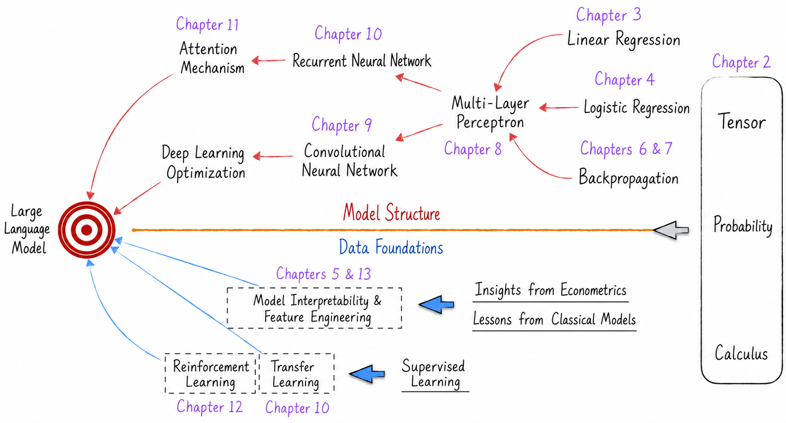

# Companion Code for *Deconstructing Large Language Models: From Linear Regression to Artificial General Intelligence*

Purchase: [JD.com](https://item.jd.com/14596264.html)

The book also includes a free companion video course on [Bilibili](https://space.bilibili.com/417265639/channel/collectiondetail?sid=3138772).

If you have praise, suggestions, or criticism for the book, please share your thoughts on [Douban](https://book.douban.com/subject/36873291/). Thank you again.

## Introduction

Well-designed implementations of classic artificial intelligence models are readily available in third-party open-source libraries, and using them is not difficult. For engineering reasons, however, these libraries introduce so many layers of abstraction and implementation details that the core structure of a model can be hard to understand. To help readers grasp the underlying principles, this book devotes considerable effort to reimplementing the essential parts of each model and annotating them in detail. Describing a subtle algorithm in human language can take a great deal of space and still fail to convey it clearly. Reading the code, by contrast, often makes the idea intuitive and transparent.

The code depends on several third-party libraries. Installation commands are provided at the beginning of the relevant scripts, which should be run in the given order. Because random numbers are involved, rerunning a script may produce slightly different results, but the overall conclusions should remain unchanged. Note that code related to large language models should be run on a GPU; otherwise, computation time will increase significantly.

## Content Overview

Large language models represented by ChatGPT are at the forefront of artificial intelligence today. Building such a complex system and fully understanding every detail requires broad knowledge across the field. A conventional learning path begins with fundamentals, gradually increases in difficulty, introduces more complex concepts, and eventually reaches the research frontier. Early in this process, however, it is often difficult to see how each topic contributes to the final goal.

To make the learning path clearer, we can reason backward: what body of knowledge is required to understand large language models in depth? The following diagram presents the core topics in this body of knowledge and their dependencies. These are also the topics covered by the book.

At the level of model architecture, the core ingredients of large language models are attention mechanisms and deep-learning optimization techniques. Attention mechanisms grew out of recurrent neural networks. To understand recurrent neural networks deeply, one must first understand the foundational neural-network model: the multilayer perceptron. Its foundation can be divided into three parts:

* Linear regression, which provides the model's skeleton.
* Activation functions, which provide the model's soul and evolved from logistic regression.
* Backpropagation and the optimization algorithms built on top of it, which provide the engineering foundation.

Convolutional neural networks marked the beginning of deep learning, and large language models have drawn extensively on the lessons they taught us about accelerating model training and evolution. The multilayer perceptron is also the foundation for understanding convolutional neural networks.

Model architecture is essential, but we must also understand the material foundation of large language models: data. The study of data focuses primarily on three areas—how models are trained, model interpretability, and feature engineering. Training large language models involves transfer learning and reinforcement learning, both of which originate in supervised learning. Model interpretation and feature engineering, meanwhile, draw on lessons from econometrics and other classic models.

Whether the subject is model architecture or data, technical discussion also depends on a mathematical foundation, particularly tensors, probability, and calculus.
