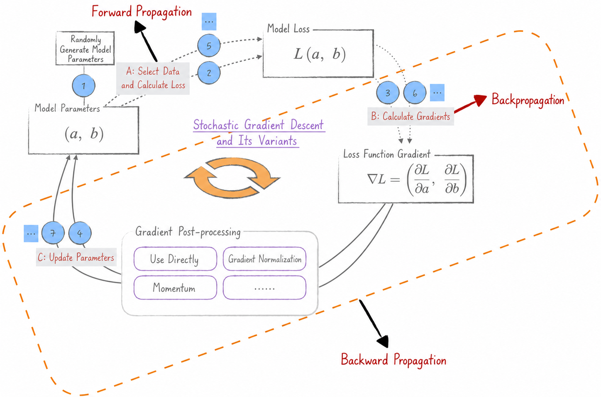

## Overview

In the vast world of neural networks, **backpropagation** (BP) is an indispensable tool for reaching new heights. It works closely with the optimization algorithms discussed in [Chapter 6](../ch06_optimizer). This close relationship, however, often causes three terms—backpropagation, forward propagation, and backward propagation—to be confused with one another. Their scope also varies across the literature, creating further confusion. This chapter therefore begins by defining the terms carefully. Building on the full optimization process introduced in Chapter 6, the diagram below introduces new notation to clarify their meanings and relationships.

Strictly speaking, **backpropagation** refers only to the algorithm that calculates gradients, not to how those gradients are used. In practice, however, the term is often used more broadly for the entire learning algorithm, including the use of gradients in optimization methods such as stochastic gradient descent.

* **Forward propagation** uses the current model parameters and input data to calculate the model's predictions.
* **Backward propagation** consists of two key steps. First, it calculates the gradient of the loss function. Second, it uses an optimization algorithm to update the model parameters and improve the model.

This chapter implements a concise version of backpropagation in Python and then uses it as a foundation for discussing engineering optimizations commonly applied to large language models.

## Code Overview

| Code | Description |
|---|---|
| [utils.py](utils.py) | Define the Scalar class and its visualization utilities |
| [linear_model.py](linear_model.py) | Define a linear regression model |
| [autograd.ipynb](autograd.ipynb) | Demonstrate forward propagation and backpropagation with a simple example |
| [optim_process.ipynb](optim_process.ipynb) | Show computation-graph expansion during training and use backpropagation to train a linear regression model |
| [gradient_accumulation.ipynb](gradient_accumulation.ipynb) | Gradient accumulation |
| [parameter_freezing.ipynb](parameter_freezing.ipynb) | Parameter freezing |
| [dropout.ipynb](dropout.ipynb) | Dropout |
| [gpu.ipynb](gpu.ipynb) | GPU computing |
