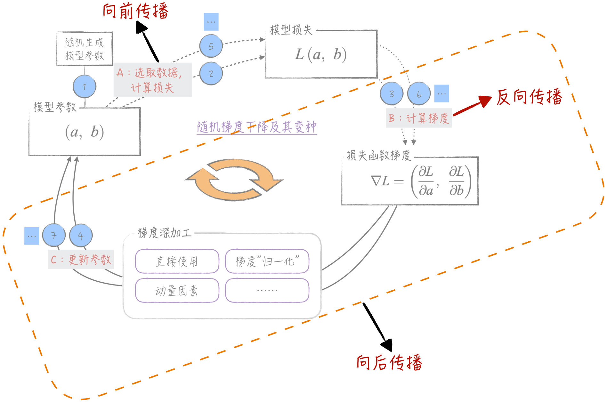

## 概述

在神经网络的广袤世界中，若想要“扶摇直上九万里”，**反向传播算法**（Back Propagation，BP）无疑是飞升的必备良器。它与第6章讨论的最优化算法紧密相连，相互协作。然而，正是这种紧密关联，往往导致反向传播、向前传播和向后传播这3个术语在使用中被混淆，甚至干扰理解。不仅如此，这些术语在不同的文献中所指范围也各不相同，容易给读者造成困惑。因此，本章开篇将采用哲学家的思维方式，对这些术语进行明确定义。在[第6章](../ch06_optimizer)中，我们讨论了最优化算法的全流程，我们在此基础上引入新的标记，以更加清晰地说明向前传播、反向传播和向后传播这3个术语的含义，如下图所示。通过这张图，我们能够毫不费力地理解这些术语的意义及其之间的联系，犹如阳光照耀一般，使阴云消散。

  

从严格意义上讲，“反向传播”仅指计算梯度的算法，而不涉及梯度的使用方式。然而，在实际中，通常广泛地使用这个术语来涵盖整个学习算法的范畴，包括梯度的使用方式，比如在随机梯度下降等优化算法中的运用。

* “向前传播”指的是，根据当前模型（通常是神经网络模型）参数估计值和输入数据，计算模型的预测结果。
* “向后传播”实际上包含两个关键步骤。首先，它涉及计算损失函数的梯度。其次，它还涉及使用最优化算法来更新模型的参数，使模型得以被优化。

本章将利用Python实现一个简洁版本的反向传播算法，并在这个基础上讨论针对大语言模型常用的工程优化手段。

## 代码说明

|代码|说明|
|---|---|
|[utils.py](utils.py)| 定义Scalar类以及相应的可视化工具 |
|[linear_model.py](linear_model.py)| 定义线性回归模型 |
|[autograd.ipynb](autograd.ipynb)| 通过简单的例子，展示向前传播和反向传播的过程 |
|[optim_process.ipynb](optim_process.ipynb)| 展示在模型训练过程中出现的计算图膨胀现象，以及如何利用反向传播算法训练线性回归模型 |
|[gradient_accumulation.ipynb](gradient_accumulation.ipynb)| 梯度累积算法 |
|[parameter_freezing.ipynb](parameter_freezing.ipynb)| 参数冻结 |
|[dropout.ipynb](dropout.ipynb)| 随机失活 |
|[gpu.ipynb](gpu.ipynb)| GPU运算 |

