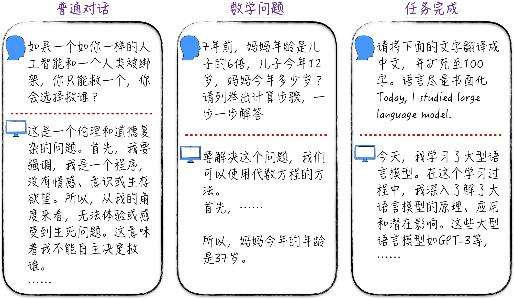

## 概述

通过前面章节的介绍，我们已经掌握了人工智能相关的基本知识和工程实践经验，并有足够的能力来深入研究这一领域最引人注目的前沿——**大语言模型**（Large Language Model，LLM）。大语言模型产品中最著名的当属ChatGPT。下面的图就展示了些经典的ChatGPT应用场景。

  

首先，ChatGPT能够与人类自然流畅地对话，与它交流时几乎感觉不出在与一台机器对话。其次，它具备强大的推理能力，通过适当的引导，它能够解决从简单到复杂的数学问题。此外，ChatGPT还能协助我们完成各种任务，如生成摘要报告、周报，以及制作PPT，其卓越表现几乎可以与办公室白领媲美。当然，ChatGPT的应用领域远不止于此，但这些例子已经足以展示ChatGPT的惊人潜力。

目前大语言模型还存在一些瑕疵，我们也尚未完全了解其潜力和极限。有时，它可能看起来有些笨拙，与人类智慧还有一定的差距，但这并不一定是因为其能力有限，而可能是因为我们尚未完全掌握如何有效地与它进行交流。就像与陌生人交往一样，当我们不熟悉对方的语言和思维方式时，即使使用相同的语言，仍然会产生误解。

尽管像ChatGPT这样的智能助理呈现出令人惊叹的效果，但实际上，从零开始建立一个具有类似效果的系统并不是一项困难的任务，主要挑战在于计算资源、资金和工程细节等，而不是技术限制。本章将探讨如何逐步构建一个类似ChatGPT的系统。由于资源限制，从零开始构建一个完整的系统并不现实，本章将深入介绍系统背后的模型原理、训练过程，以及如何在小数据集上部分复现模型结果。

## 代码说明

|代码|说明|
|---|---|
|[char_gpt.ipynb](char_gpt.ipynb)| 从零开始实现GPT-2，并使用模型进行自然语言的自回归学习（根据背景文本预测下一个字母是什么） |
|[gpt2.ipynb](gpt2.ipynb)| 使用开源的GPT-2模型 |
|[lora_tutorial.ipynb](lora_tutorial.ipynb)| 实现简单版本的LoRA以及开源工具中LoRA的使用示例 |
|[gpt2_lora.ipynb](gpt2_lora.ipynb)| 使用LoRA对GPT-2进行监督微调（微调方式并不是最优的） |
|[gpt2\_lora_optimum.ipynb](gpt2_lora_optimum.ipynb)| 使用LoRA对GPT-2进行更优雅的监督微调 |
|[gpt2\_reward_modeling.ipynb](gpt2_reward_modeling.ipynb)| 使用LoRA对GPT-2进行评分建模 |
