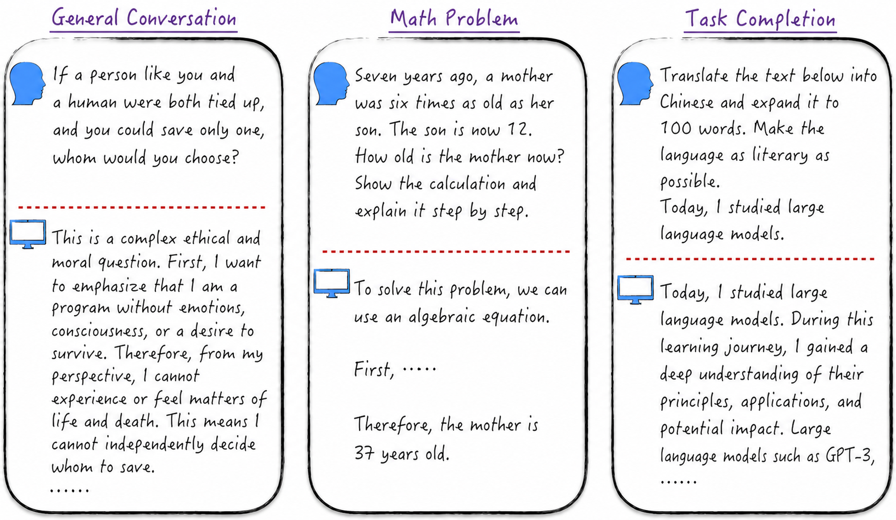

## Overview

The preceding chapters have equipped us with the fundamental knowledge and engineering experience needed to study the most compelling frontier in artificial intelligence: the **large language model** (LLM). ChatGPT is the best-known product built on this technology. The diagram below presents several classic ChatGPT use cases.

First, ChatGPT can converse naturally and fluently with people, making it easy to forget that one is speaking with a machine. Second, it has powerful reasoning abilities and, with appropriate guidance, can solve mathematical problems ranging from simple to complex. ChatGPT can also help complete many everyday tasks, including preparing summaries, weekly reports, and presentations. Its performance can rival that of an office professional. Its applications extend far beyond these examples, but they already demonstrate its remarkable potential.

Large language models still have imperfections, and we do not yet fully understand their potential or limits. At times they may appear clumsy or fall short of human intelligence. This does not necessarily mean their capabilities are limited; it may mean that we have not yet learned how to communicate with them effectively. The situation resembles meeting a stranger: when we do not understand the other person's language and way of thinking, misunderstandings can arise even when we ostensibly speak the same language.

Although intelligent assistants such as ChatGPT produce astonishing results, building a system with similar capabilities from scratch is not technically impossible. The primary challenges are computing resources, funding, and engineering details rather than fundamental technical barriers. This chapter explains how to construct a ChatGPT-like system step by step. Resource constraints make it impractical to build a complete system from scratch here, so the chapter instead examines the underlying model principles and training process and partially reproduces the results on a small dataset.

## Code Overview

| Code | Description |
|---|---|
| [char_gpt.ipynb](char_gpt.ipynb) | Implement GPT-2 from scratch and use it for autoregressive language learning by predicting the next character from context |
| [gpt2.ipynb](gpt2.ipynb) | Use an open-source GPT-2 model |
| [lora_tutorial.ipynb](lora_tutorial.ipynb) | Implement a simple version of LoRA and demonstrate LoRA in open-source tools |
| [gpt2_lora.ipynb](gpt2_lora.ipynb) | Supervised fine-tuning of GPT-2 with LoRA using a deliberately non-optimal approach |
| [gpt2\_lora_optimum.ipynb](gpt2_lora_optimum.ipynb) | Supervised fine-tuning of GPT-2 with LoRA using a more elegant approach |
| [gpt2\_reward_modeling.ipynb](gpt2_reward_modeling.ipynb) | Train a reward model for GPT-2 with LoRA |
